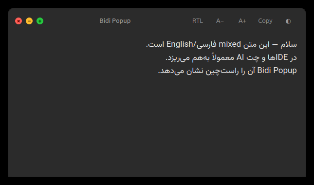

# Bidi Popup

ابزاری سبک برای **لینوکس (X11 و Wayland)** که متن انتخاب‌شده را در یک **پنجره راست‌چین** نشان می‌دهد — مخصوص خواندن متن مخلوط **فارسی/انگلیسی** (یا عربی/عبری) داخل برنامه‌هایی که راست‌چین را درست نشان نمی‌دهند (IDE، مرورگر، چت AI و …).

با **`Ctrl+Alt+Space`** یک پنجره شبیه macOS کنار موس باز می‌شود و متن را درست و راست‌چین می‌بینی.



[-blue)](https://github.com/ha3san/bidi-popup)
[](https://www.python.org/)
[](LICENSE)

---

## چرا؟

خیلی از برنامه‌ها متن دوزبانه RTL/LTR را به‌هم‌ریخته نشان می‌دهند. به‌جای جنگیدن با UI، متن را انتخاب کن و با یک کلید میانبر در پنجرهٔ مخصوص RTL بخوان.

## امکانات

- میانبر: `Ctrl+Alt+Space`
- پشتیبانی **X11** و **Wayland**
- خواندن **متن انتخاب‌شده** (highlight) — بدون نیاز به Ctrl+C
- ظاهر شبیه macOS: دکمه‌های قرمز/زرد/سبز، drag، resize، سایه
- تعویض RTL/LTR، اندازه فونت، تم روشن/تاریک (هماهنگ با GNOME)
- رندر Markdown اگر متن شبیه markdown باشد
- آیکون کنار ساعت (system tray) و اجرای خودکار بعد از لاگین

---

## پیش‌نیازها

- اوبونتو یا توزیع مشابه لینوکس
- Python **۳.۱۰+**
- محیط گرافیکی **X11** یا **Wayland**

### بسته‌های سیستمی

**X11:**
```bash
sudo apt install -y python3-venv python3-pip xclip
```

**Wayland:**
```bash
sudo apt install -y python3-venv python3-pip wl-clipboard
```

**هر دو (پیشنهادی):**
```bash
sudo apt install -y python3-venv python3-pip xclip wl-clipboard
```

### فونت فارسی (پیشنهادی)

```bash
sudo apt install -y fonts-vazirmatn
```

### نوع session تو

```bash
echo $XDG_SESSION_TYPE
```

- `x11` → hotkey خودکار کار می‌کند
- `wayland` → بعد از نصب، یک‌بار `install-shortcut.sh` لازم است

---

## نصب

**سریع (یک اسکریپت):**
```bash
git clone https://github.com/ha3san/bidi-popup.git
cd bidi-popup
chmod +x install.sh
./install.sh
```

**دستی:**
```bash
git clone https://github.com/ha3san/bidi-popup.git
cd bidi-popup

python3 -m venv .venv
source .venv/bin/activate
pip install -r requirements.txt

chmod +x start.sh install-autostart.sh install-shortcut.sh
```

---

## استفاده

### روزمره

1. برنامه را اجرا کن: `./start.sh`
2. متن را در هر برنامه **انتخاب** کن (highlight)
3. **`Ctrl+Alt+Space`** را بزن
4. متن را **راست‌چین** در پنجره بخوان
5. با **`Esc`** یا دکمهٔ قرمز (×) ببند

### X11 vs Wayland

| محیط | hotkey چطور کار می‌کند |
|------|------------------------|
| **X11** | خودکار — نیازی به تنظیم اضافه نیست |
| **Wayland (GNOME)** | یک‌بار `./install-shortcut.sh` بزن |

روی Wayland، shortcut از طریق GNOME به `./start.sh trigger` وصل می‌شود.

### میانبرهای داخل پنجره

| کلید | کار |
|------|-----|
| `Esc` | بستن پنجره |
| `Ctrl+C` | کپی متن از پنجره |
| `Ctrl+F` | جستجو در متن |
| `Ctrl+=` / `Ctrl+-` | بزرگ‌تر / کوچک‌تر کردن فونت |

دکمه‌های نوار بالا: **RTL/LTR** · **A− / A+** · **Copy** · **تم (◐)**

### اجرا

```bash
./start.sh
```

فقط **یک نمونه** در پس‌زمینه اجرا می‌شود (با `flock`).

### اجرای خودکار بعد از لاگین (اوبونتو / GNOME)

```bash
./install-autostart.sh
```

### تنظیم shortcut روی Wayland (GNOME)

```bash
./install-shortcut.sh
```

این دستور `Ctrl+Alt+Space` را در تنظیمات کیبورد GNOME ثبت می‌کند.

---

## ساختار پروژه

| فایل / پوشه | کار |
|-------------|-----|
| `listener.py` | سرویس پس‌زمینه + tray |
| `popup.py` | رابط پنجره |
| `theme.py` | تم روشن/تاریک |
| `bidi_platform/` | تشخیص X11/Wayland، selection، trigger |
| `start.sh` | اجرا / `trigger` |
| `install-autostart.sh` | autostart |
| `install-shortcut.sh` | shortcut GNOME (Wayland) |
| `install.sh` | نصب خودکار venv + وابستگی‌ها |
| `assets/icon.svg` | آیکون اپلیکیشن |

## محدودیت‌ها

- hotkey خودکار روی Wayland فقط با shortcut دسکتاپ (GNOME: `install-shortcut.sh`)
- KDE و compositorهای دیگر: shortcut را دستی به `./start.sh trigger` وصل کن
- روی Wayland باید `./start.sh` قبل از shortcut در حال اجرا باشد

## لایسنس

[MIT](LICENSE)

---
---

# English

A lightweight **Linux (X11 & Wayland)** tool that shows selected text in a **right-to-left popup**.

Press **`Ctrl+Alt+Space`** to open a macOS-style RTL popup near your cursor.

## Platform notes

| Session | Hotkey |
|---------|--------|
| X11 | Built-in (`pynput`) |
| Wayland (GNOME) | Run `./install-shortcut.sh` once |

## Requirements

```bash
sudo apt install python3-venv python3-pip xclip wl-clipboard
sudo apt install fonts-vazirmatn   # optional
```

## Install & run

```bash
git clone https://github.com/ha3san/bidi-popup.git
cd bidi-popup
python3 -m venv .venv && source .venv/bin/activate
pip install -r requirements.txt
chmod +x start.sh install-autostart.sh install-shortcut.sh

./start.sh
./install-autostart.sh    # autostart on login
./install-shortcut.sh     # Wayland / GNOME shortcut
```

## License

[MIT](LICENSE)
